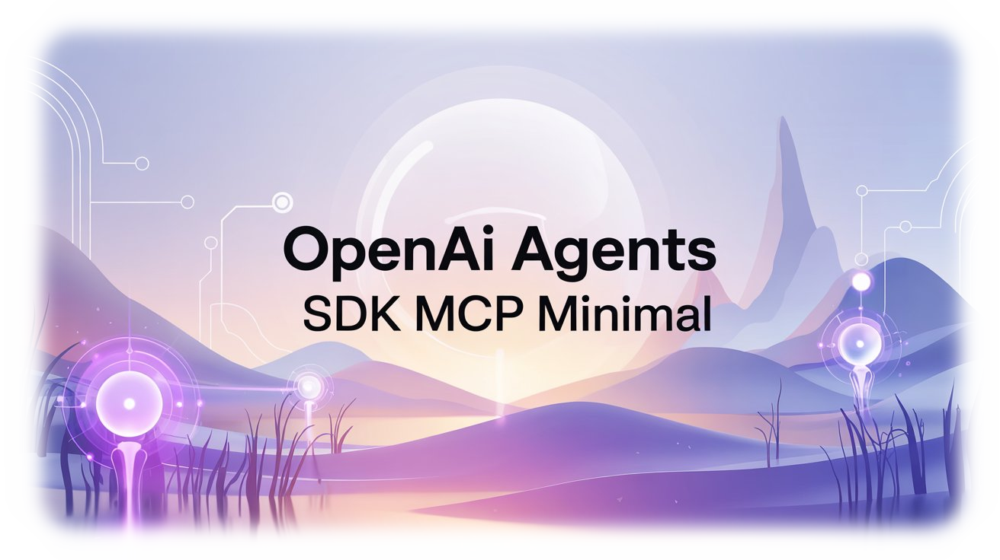

<div align="center">



# openai-agents-sdk-mcp minimal

  
  
  

</div>

<p align="center">
OpenAIのAgents SDKを使用して、MCPサーバーを利用したAIエージェントを作成します。
</p>

## 目次

- [環境のセットアップ](#環境のセットアップ)
- [環境変数](#環境変数)
- [環境に応じた設定](#環境に応じた設定)
- [実行方法](#実行方法)
- [プロジェクト構造](#プロジェクト構造)

## 環境のセットアップ

1. このリポジトリをクローンします。

2. Python仮想環境を作成してアクティベートします。

```bash
# uvをインストール（初回のみ）
sudo snap install astral-uv --classic

# 仮想環境の作成
uv venv

# 仮想環境のアクティベート
source .venv/bin/activate
```

3. 必要なパッケージをインストールします。

```bash
uv pip install -r requirements.txt
```

4. `.env`ファイルを作成します。

```bash
cp .env.example .env
```

## 環境変数

以下の環境変数を`.env`ファイルに設定する必要があります：

| 環境変数 | 説明 | 取得方法 |
|----------|------|----------|
| `OPENAI_API_KEY` | OpenAI APIのキー | [OpenAIのダッシュボード](https://platform.openai.com/api-keys)から取得 |
| `BRAVE_API_KEY` | Brave Search APIのキー | [Brave Search API](https://brave.com/search/api/)から取得 |

```bash
OPENAI_API_KEY=your_openai_api_key
BRAVE_API_KEY=your_brave_api_key
```

## 環境に応じた設定

`main.py`のnpxコマンドのパスは、使用する環境に応じて変更してください：

```python
"command": "npx"
```

### 参考：
```python
"command": "/Users/user/.volta/bin/npx",  # MacOS環境用（volta利用時）
"command": "C:\\Program Files\\nodejs\\npx.cmd",  # Windows環境用
```

## 実行方法

プログラムを実行します：

```bash
python main.py
```

## プロジェクト構造

```
.
├── main.py           # メインのアプリケーションファイル
├── README.md         # プロジェクトのドキュメント
├── requirements.txt  # Pythonの依存関係
├── .env.example     # 環境変数のテンプレート
└── .gitignore       # Gitの除外設定
```
